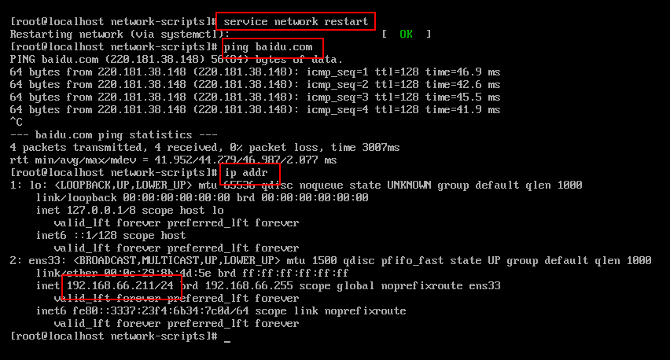

> 使用 VMware 安装 Centos 7，并使用 Xshell 连接。

<!--more-->

# 1. 下载Linux虚拟机镜像

下载地址：

```http
http://mirrors.aliyun.com/centos/7/isos/x86_64/
```

本文下载版本为：CentOS-7-x86_64-DVD-2003.iso   


# 2. 使用  VMware  安装

1. 打开 VMware 新建虚拟机。


2. 点击典型，再点击下一步。


3. 稍后安装操作系统，再点击下一步。


4. 选择操作系统和版本，再点击下一步。


5. 选择虚拟机名称和虚拟机安装位置，再点击下一步。


6. 指定虚拟机磁盘大小，如果安装时分配的内存不够，后期还可以继续改，再点击下一步。


7. 选择自定义硬件。


8. 根据自己电脑的配置选择，点击关闭之后会自动保存。


9. 完成安装。


# 3. 启动虚拟机

1. 在 VMware 中启动虚拟机。


2. 进入虚拟机界面，点击鼠标，让鼠标进入虚拟机界面，然后使用 ↑ ↓ 箭头选择 Install CentOS 7。


3. 选择简体中文，下一步。


4. 安装配置，软件选择可以选择带图形界面的（像 Windows 一样的图形界面），最小安装只有命令窗口；安装位置选择自动分区，打开以太网连接。然后点击开始安装进行安装。


5. 设置 root 密码和创建用户，如果密码级别较弱，需要连续点击两次完成按钮完成密码设置操作。


6. 安装完成之后，点击重启。


7. 使用 root 账户或者安装时创建的用户账号登录系统，此处密码默认不显示，需要自己确定输入正确。


# 4. 虚拟机设置

## 4.1 固定 IP 地址

1. 虚拟机设置，使用 NAT 模式。

   


2. 查看网关地址并记住。编辑—>虚拟机网络编辑器，记住自己的网关地址。

   


3.  修改网卡信息 。

   ```bash
   # 进入网卡文件所在文件夹
   cd /etc/sysconfig/network-scripts
   
   # 查看网卡文件，不同版本的 centos7，网卡名字不同，eno1677(centos7.0)，ens33(centos7.3) 
   ls
   
   # 修改网卡信息，管理员账号可以不用 sudo
   sudo vi ifcfg-ens33
   ```

   

   ```bash
   # 此处为具体网卡配置，带注释的地方需要配置
   
   TYPE="Ethernet"
   PROXY_METHOD="none"
   BROWSER_ONLY="no"
   # 开机协议设置为 static
   BOOTPROTO="static"
   DEFROUTE="yes"
   IPV4_FAILURE_FATAL="no"
   IPV6INIT="yes"
   IPV6_AUTOCONF="yes"
   IPV6_DEFROUTE="yes"
   IPV6_FAILURE_FATAL="no"
   IPV6_ADDR_GEN_MODE="stable-privacy"
   NAME="ens33"
   UUID="eba23382-ebae-45c9-9faf-203e4417b8f4"
   DEVICE="ens33"
   # 开机启动
   ONBOOT="yes"
   
   # 设置为想要固定的ip地址
   IPADDR="192.168.66.221"
   # 子网掩码
   NETMASK="255.255.255.0"
   # 网关，需要和 VMnet8中设置的网关保持一致
   GATEWAY="192.168.66.2"
   # 主 DNS1 地址，按照设置即可
   DNS1="114.114.114.114"
   ```

   

   ```bash
   # 重启网卡
   service network restart
   
   # 测试是否连通，是否连通外网，本机 ip 地址是否正确
   ping baidu.com
   
   ip addr
   ```

   


## 4.2 关闭防火墙

```bash
# 查看防火墙状态
systemctl status firewalld

# 停止防火墙
systemctl stop firewalld

# 禁止开机启动
systemctl disable firewalld
```


## 4.4 使用 xshell 连接

主机地址使用刚刚固定的 IP 地址，账号密码使用 管理员账号或者其他可以登录虚拟机的账号。


## 4.5 安装工具

```bash
yum -y install wget

yum -y install vim*
```


# 5. Linux 出现的网络问题

> [CentOS网络服务起不来 Job for network.service failed](https://blog.csdn.net/u012904764/article/details/95883192)
`service network restart` 和 `systemctl start network.service` 启动centos 网络服务出错，

```
Restarting network (via systemctl): Job for network.service failed because the control process exited with error code.
See "systemctl status network.service" and "journalctl -xe" for details.
```


原因：centos 系统上，目前有 NetworkManager 和 network 两种网络管理工具。如果两种都配置会引起冲突，而且 NetworkManager 在网络断开的时候，会清理路由，如果一些自定义的路由，没有加入 到NetworkManager 的配置文件中，路由就被清理掉，网络连接后需要自定义添加上去。


解决方法:

```bash
# 停止 networkmanager 服务
# 暂时停
systemctl stop NetworkManager

# 永久停止
systemctl disable NetworkManager
```

```bash
# 重启网卡
ststemctl restart network
ststemctl status network
```

