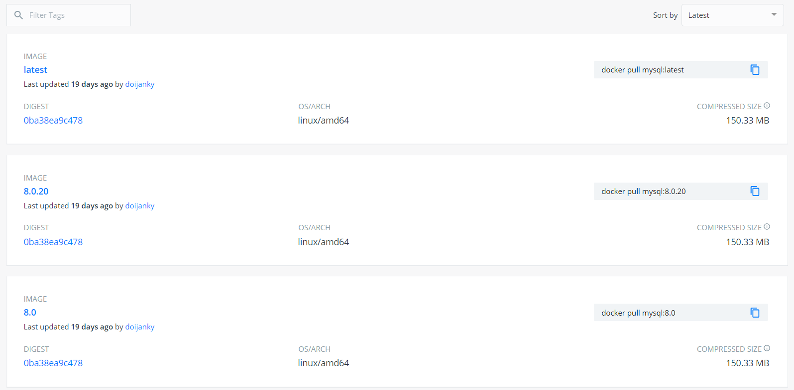
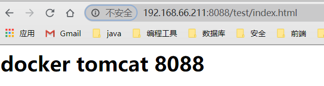

> 介绍使用 docker 安装应用的基本步骤，并且使用 docker 安装 Java 开发中常用的组件。

<!--more-->


# 1. docker 安装应用的基本流程

## 1.1 拉取镜像

在安装应用之前，首先需要查找可以使用的版本，可以在 [Docker Hub]( https://hub.docker.com/ ) 中查看，`docker search [OPTIONS]` 命令也是在  [Docker Hub]( https://hub.docker.com/ ) 中查看可用的版本。

下图为在 Docker Hub 中查看 MySQL 镜像。




一些和镜像有关的基本命令。

- 下载镜像： 从 Docker 仓库中下载镜像到本地，镜像的名称格式为 `名称:版本号`，如果版本号不指定则是最新的版本，如果不知道镜像版本，可以去 docker hub 搜索对应镜像查看。

  ```bash
  docker pull 镜像名称:版本
  ```

  

- 删除本地镜像。

  ```bash
  docker rmi 镜像id  # 删除指定的本地镜像
  docker rmi `docker images -q`  # 删除所有本地镜像
  ```

  

- 查看本地镜像。

  ```bash
  docker images
  docker images -q  # 查看所有镜像的 id
  ```

  


## 1.2 创建实例

每一个实例都是从对应的镜像中创建而来。


一些和容器有关的命令

- 查看容器。

  ```bash
  docker ps # 查看正在运行的容器
  docker ps –a # 查看所有容器
  ```

  

- 停止/启动容器。

  ```bash
  docker start 容器名 # 启动已经被停止的容器
  docker stop 容器名 # 停止正在运行的容器
  docker restart 容器名 # 重启容器
  ```

  

- 进入容器。

  ```bash
  docker exec 参数 # 退出容器，容器不会关闭
  ```

  

- 删除容器：安全删除操作，先停止正在运行的容器，然后将容器删除。

  ```bash
  docker rm -v nginx01 # 删除容器 nginx01, 并删除容器挂载的数据卷
  ```

  


## 1.3 设置自动重启

每一次开启服务器时，不仅需要重新启动 docker 服务，还需要重新启动 docker 创建的实例，使用下面的命令可以设置实例自动重启，节省时间。

```bash
docker update [docker id] --restart=always
```


# 2. 安装 MySQL


## 2.1 下载镜像创建实例

下载镜像文件。

```bash
docker pull mysql:5.7
```


创建实例并启动。

```bash
docker run -p 3306:3306 --name mysql \
-v /mydata/mysql/log:/var/log/mysql \
-v /mydata/mysql/data:/var/lib/mysql \
-v /mydata/mysql/conf:/etc/mysql \
-e MYSQL_ROOT_PASSWORD=root \
-d mysql:5.7
```

- `-p 3306:3306` ：将容器的 3306 端口(第二个 3306)射到主机的 3306 端口(第一个 3306)。
- `--name mysql` ：将新建的实例命名为 MySQL，可以随便取名。
- `-v /mydata/mysql/log:/var/log/mysql` ：将容器的日志目录挂载到主机的 `/mydata/mysql/log` 目录（不需要手动创建主机目录，在创建实例时会自动创建）。
- `-v /mydata/mysql/data:/var/lib/mysql` ：将容器的数据目录挂载到主机的 `/mydata/mysql/data` 目录。
- `-v /mydata/mysql/conf:/etc/mysql` ：将文件的配置目录挂载到主机的 `/mydata/mysql/conf` 目录。
- `-e MYSQL_ROOT_PASSWORD=root` ：初始化 root 用户的密码为 root。
- `-d mysql:5.7` ：使用 mysql:5.7 版本的镜像来创建实例。


## 2.2 基本配置

由于在创建实例时将 MySQL 容器的配置目录挂载到了主机，在运行 MySQL 时会加载主机的配置目录里面的配置文件信息。


在配置目录下新建文件 my.cnf ，将 MySQL 的配置写入此文件。

```bash
# 在配置目录下新建 my.cnf
vim /mydata/mysql/conf/my.cnf
```


具体文件配置。

```bash
[client]
default-character-set=utf8
 
[mysql]
default-character-set=utf8
 
[mysqld]
init_connect='SET collation_connection = utf8_unicode_ci'
init_connect='SET NAMES utf8'
character-set-server=utf8
collation-server=utf8_unicode_ci
skip-character-set-client-handshake
# 跳过域名检查
skip-name-resolve
```


重新启动 MySQL 容器。

```bash
docker restart [mysql id]
```


## 2.3 其他配置

通过 docker 容器的 exec 命令可以进入容器。

```bash
# 进入名称为 mysql 的容器内部
docker exec -it mysql /bin/bash
```


登录mysql。

```bash
mysql -uroot -p
```


设置远程连接。

```bash
grant all privileges on *.* to 'root'@'%' identified by 'root' with grant option;
flush privileges;
```


## 2.4 自动重启

```bash
docker update mysql --restart=always
```


# 3. 安装 Tomcat


## 3.1 下载镜像创建实例

拉取 tomcat 最新版本。

```bash
docker pull tomcat
```


创建别名为 tomcat 的容器，并将 tomcat 容器的 webapps 目录挂载到主机 `/mydata/tomcat/root` 目录。

```bash
docker run -id --name=tomcat \
-p 8088:8080 \
-v /mydata/tomcat/root:/usr/local/tomcat/webapps \
-d tomcat 
```


## 3.2 测试

在主机目录 `/mydata/tomcat/root` 下新建目录 test，在 test 目录下创建文件 index.html。

```
cd /mydata/tomcat/root
mkdir test
cd test
vim index.html
```

```html
<h1>docker tomcat 8088</h1>
```


访问  `http://{ip}:8088/test/index.html` 查看效果。



## 3.2 设置自动重启

```bash
docker update tomcat --restart=always
```


# 4. 安装 Redis

## 4.1 创建实例

拉取最新镜像。

```bash
docker pull redis
```


创建 redis 的配置文件。

```bash
mkdir -p /mydata/redis/conf
touch /mydata/redis/conf/redis.conf
```


redis 容器目录只到 `/etc/redis` ，默认会将最后一级当作目录，需要提前创建好配置文件，nginx 容器启动时会读取 redis.conf 配置文件。

```bash
docker run -p 6379:6379 --name redis \
-v /mydata/redis/conf/redis.conf:/etc/redis/redis.conf \
-d redis redis-server /etc/redis/redis.conf
```


## 4.2 测试连接

```
docker exec -it redis redis-cli
```


## 4.3 修改配置

默认 redis 存储在内存中，重启之后数据会丢失，需要配置持久化。

```bash
vim /mydata/redis/conf/redis.conf

# 添加配置
appendonly yes
```


设置自动重启。

```
docker update redis --restart=always
```


# 5. 安装 zookeeper

拉取镜像。

```
docker pull zookeeper
```


创建容器。

```
docker run  -p 2181:2181 --privileged=true  --name zookeeper  -d  zookeeper
```


